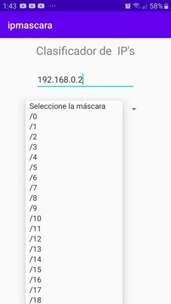
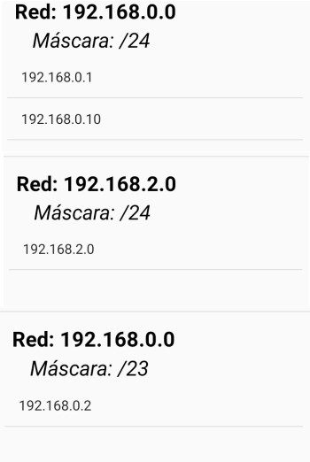

# Classifying IP and Network mask
This project classify the IP Addresses according to the network mask.
## 1. Examples
 ### 1.   Introduce IP and select the Network mask (Introducimos la IP y seleccionamos la máscara de red)
 
 
 
 ### 2. Table with IPs
 
 